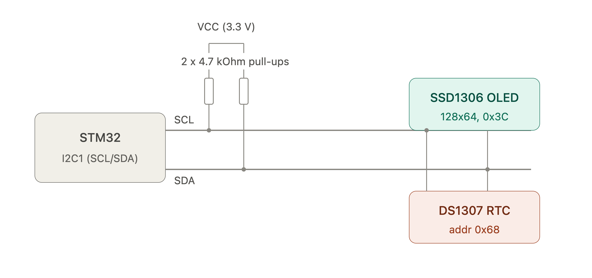

# STM32 I²C Clock & OLED Display (DS1307 + SSD1306)

---

## 📌 Features

- [x] Initialization of the **I²C1** bus in STM32 (Fast/Standard mode).
- [x] Reading date and time from the RTC module **DS1307**.
- [x] Display the current time in `HH:MM:SS` format (in large bold font).
- [x] Display the date in `EEE DD.MM.YYYY` format (for example, `Sat 14.02.2026`).
- [x] Data updates on the screen every **500 ms** (at least once per second).
- [x] **Optional Task (Animation):** Graphical rectangular progress bar of seconds at the bottom of the screen.
- [x] Modular and structured code architecture (separate files for RTC and graphics library).

---

## 🛠 Used

- **Microcontroller:** STM32 (F4 series)
- **Development environment:** STM32CubeIDE
- **HAL:** STM32 Hardware Abstraction Layer
- **Graphics library:** [u8g2](https://github.com/olikraus/u8g2) (adapted for STM32 HAL)

---

## 🔌 Pinouts

The DS1307 and SSD1306 modules are connected **in parallel** to the same **I²C1** bus.

| Component        | Module pin | STM32 pin | Description             |
| :--------------- | :--------- | :-------- | :---------------------- |
| **SSD1306 OLED** | **VCC**    | `3.3V`    | Display power 3.3 В     |
|                  | **GND**    | `GND`     | Common GND              |
|                  | **SCL**    | `PB6`     | Clock line (I2C1_SCL)   |
|                  | **SDA**    | `PB7`     | Data line (I2C1_SDA)    |
|                  |            |           |                         |
| **DS1307 RTC**   | **VCC**    | `5V`      | Живлення RTC модуля 5 В |
|                  | **GND**    | `GND`     | Common GND              |
|                  | **SCL**    | `PB6`     | Clock line (I2C1_SCL)   |
|                  | **SDA**    | `PB7`     | Data line (I2C1_SDA)    |

---

