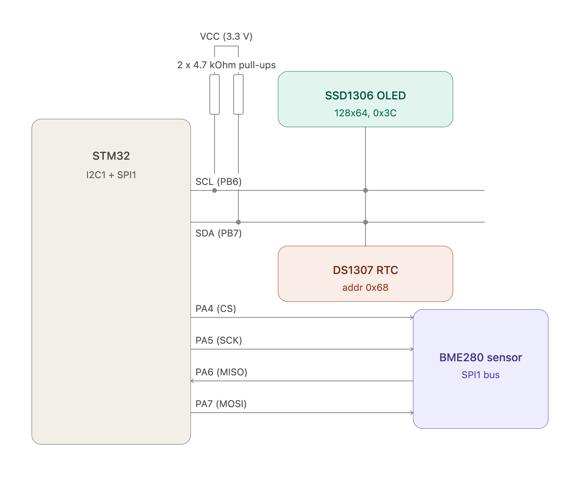

# Homework 4.4 — STM32 I²C Clock & OLED Display with BME280 Environment Sensor

**DS1307 (I²C) + SSD1306 (I²C) + BME280 (SPI)**

---

## 📌 Features

- [x] Initialization of the **I²C1** bus in STM32 (Fast/Standard mode).
- [x] Initialization of the **SPI1** bus in STM32 for the BME280 sensor.
- [x] Reading date and time from the RTC module **DS1307**.
- [x] Reading temperature (°C), humidity (%RH), and pressure (hPa) from the **BME280** over SPI.
- [x] Display the current time in `HH:MM:SS` format (in large bold font).
- [x] Display the date in `EEE DD.MM.YYYY` format (for example, `Sat 14.02.2026`).
- [x] Display environment readings in a single line: `T:23.4C RH:45% P:1013hPa`.
- [x] Data updates on the screen every **500 ms** (at least once per second).
- [x] BME280 readings refreshed at least once per second, polled via `HAL_GetTick()` — no blocking `HAL_Delay()` in the sampling loop.
- [x] All values shown on screen are duplicated to the logging system.
- [x] **Optional Task (Animation):** Graphical rectangular progress bar of seconds at the bottom of the screen.
- [x] Modular and structured code architecture (separate files for RTC, graphics library, and BME280 driver).

---

## 🛠 Used

- **Microcontroller:** STM32 (F4 series)
- **Development environment:** STM32CubeIDE
- **HAL:** STM32 Hardware Abstraction Layer
- **Graphics library:** [u8g2](https://github.com/olikraus/u8g2) (adapted for STM32 HAL)
- **Sensor driver:** custom BME280 SPI driver (`bme280.h` / `bme280.c`), fixed-point Bosch compensation formulas

---

## 🔌 Pinouts

The SSD1306 and DS1307 modules sit **in parallel on the same I²C1 bus**. The
BME280 is wired **separately, over SPI1** — it is a different protocol, not
just different pins, so double-check you're not accidentally trying to talk
I²C to it.

| Component        | Module pin | STM32 pin | Description                                                       |
| :--------------- | :--------- | :-------- | :---------------------------------------------------------------- |
| **SSD1306 OLED** | **VCC**    | `3.3V`    | Display power 3.3 В                                               |
|                  | **GND**    | `GND`     | Common GND                                                        |
|                  | **SCL**    | `PB6`     | Clock line (I2C1_SCL)                                             |
|                  | **SDA**    | `PB7`     | Data line (I2C1_SDA)                                              |
|                  |            |           |                                                                   |
| **DS1307 RTC**   | **VCC**    | `5V`      | power RTC module 5 В                                              |
|                  | **GND**    | `GND`     | Common GND                                                        |
|                  | **SCL**    | `PB6`     | Clock line (I2C1_SCL)                                             |
|                  | **SDA**    | `PB7`     | Data line (I2C1_SDA)                                              |
|                  |            |           |                                                                   |
| **BME280**       | VCC        | `3.3V`    | Sensor power                                                      |
|                  | GND        | `GND`     | Common ground                                                     |
|                  | SCL        | `PA5`     | SPI1_SCK — this module's "SCL" pin doubles as SPI clock           |
|                  | SDA        | `PA7`     | SPI1_MOSI — this module's "SDA" pin doubles as SPI data-in        |
|                  | SDO        | `PA6`     | SPI1_MISO — also selects the I²C address in I²C mode; unused here |
|                  | CSB        | `PA4`     | GPIO output, chip-select                                          |

> ⚠️ Adjust the SPI1 pin assignments above to whatever CubeMX actually generated for your board — `PA4`–`PA7` is the common default for STM32F4 Nucleo boards, but confirm against your own `.ioc` file.

---



---

## Setting Up u8g2 in STM32CubeIDE

u8g2's entire platform-independent implementation lives in its `csrc` folder
(pure C, no external dependencies):

```bash
git clone https://github.com/olikraus/u8g2.git
```

1. Copy the `u8g2/csrc` folder into your project, e.g. under `Middlewares/u8g2/`.
2. In CubeIDE: right-click the project → `Properties` → `C/C++ General` → `Paths and Symbols` → `Includes` → add the path to `Middlewares/u8g2`.
3. On the same screen, `Source Location` tab — confirm `Middlewares/u8g2`
   is listed as a source folder, so all its `.c` files actually get compiled
   in.
4. Refresh the index: right-click the project → `Index → Rebuild`.

---

## Enabling `float` in `printf`/`snprintf`

STM32CubeIDE links against **newlib-nano** by default — a size-reduced C
library that silently drops floating-point support from the `printf` family
unless you turn it back on. Without this, format specifiers like `%.1f` will
print garbage or nothing at all, which will make the `T:23.4C RH:45%
P:1013hPa` line fail even though the BME280 readings themselves are correct.

`Project` → `Properties` → `C/C++ Build` → `Settings` → `Tool Settings` → `MCU Settings` → enable **"Use float with printf from newlib-nano
(-u \_printf_float)"**.

Do a clean rebuild afterward — this setting doesn't take effect on an
incremental build.

---
