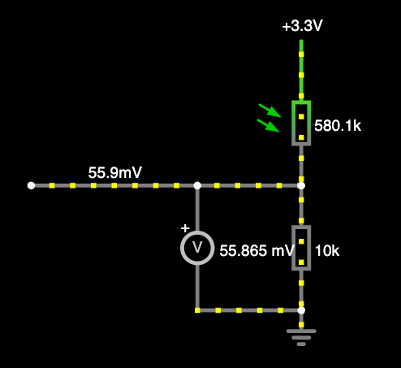
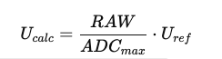

# Модуль 1.6. Домашнє завдання: Вимірювання освітленості за допомогою LDR та ESP32-S3

Завдання:

1. Підключити LDR до ESP32-S3 у вигляді подільника напруги.
2. Зчитувати значення АЦП кожні 100 мс.
3. Зчитати значення з АЦП за допомогою analogRead() (RAW data).
4. Обчислити напругу за формулою:

5. Зчитати напругу за допомогою analogReadMillivolts().
6. Вивести в серійну консоль:

- RAW значення АЦП
- Обчислену напругу
- Напругу, виміряну analogReadMillivolts()

7. Порівняти обидва значення напруги та обчислити похибку.

Результат:
У консоль має виводитись таблиця або структурований текст із результатами вимірювань та розрахованою похибкою (можна у відсотках).

Додаткове (опційне) завдання

1. Змінити бітність АЦП за допомогою analogReadResolution()
   (наприклад: 9, 10, 11, 12 біт).
2. Змінити атенюацію АЦП за допомогою analogSetPinAttenuation()
   (наприклад: ADC_0db, ADC_2_5db, ADC_6db, ADC_11db).
3. Для кожної комбінації параметрів:

- зафіксувати діапазон вимірюваних напруг
- порівняти стабільність та похибку вимірювань

4. Зробити висновок про вплив атенюації та бітності АЦП на точність і роздільну здатність вимірювань.
